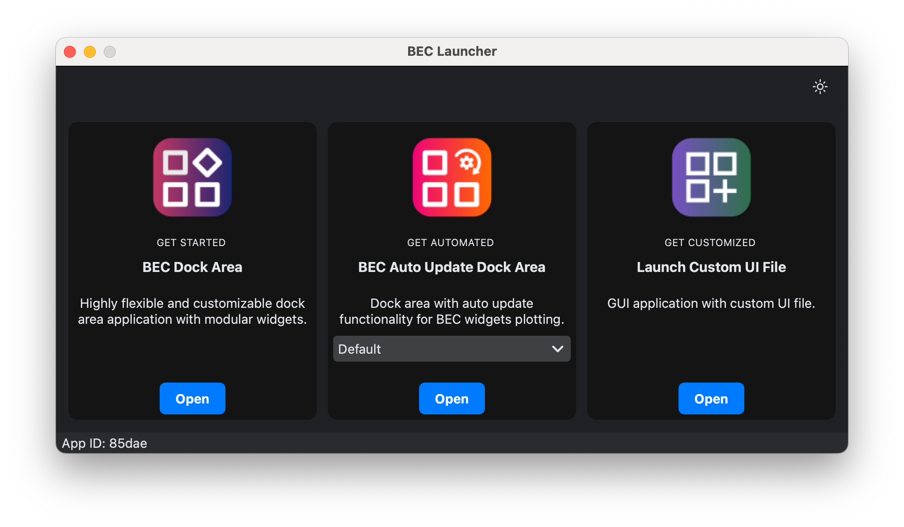

(user.auto_updates)=
# Auto updates
BEC Widgets provides a simple way to update the entire GUI configuration based on events. These events can be of different types, such as a new scan being started or completed, a button being pressed, a device reporting an error or the existence of a specific metadata key. This allows the users to streamline the experience of the GUI and to focus on the data and the analysis, rather than on the GUI itself.

The auto update widget can be launched through the BEC launcher:



The auto update's launch tile also provides a combo box to select the specific auto update to be launched. These options are automatically populated with all available auto updates from a plugin repository and the default auto update. 

Once the proper auto update is selected and launched, the CLI will automatically add a new entry to the `gui` object. 

The default auto update only provides a simple handler that switches between `line_scan`, `grid_scan` and `best_effort`. More details can be found in the following snippet. 

````{dropdown} Auto Updates Handler
:icon: code-square
:animate: fade-in-slide-down
:open: 
```{literalinclude} ../../../bec_widgets/widgets/containers/auto_update/auto_updates.py
:pyobject: AutoUpdates.on_scan_open
```
````

As shown, the default auto updates switches between different visualizations whenever a new scan is started. If the scan is a `line_scan`, the `simple_line_scan` update method is executed. 

````{dropdown} Auto Updates Simple Line Scan
:icon: code-square
:animate: fade-in-slide-down
:open: 
```{literalinclude} ../../../bec_widgets/widgets/containers/auto_update/auto_updates.py
:pyobject: AutoUpdates.simple_line_scan
```
````

As can be seen from the above snippet, the update method changes the dock to a specific widget, in this case to a waveform widget. After selecting the device for the x axis, the y axis is retrieved from the list of monitored devices or from a user-specified `selected_device`. 

The y axis can also be set by the user using the `selected_device` attribute:

```python
gui.AutoUpdates.selected_device = 'bpm4i'
```


````{dropdown} Auto Updates Code
:icon: code-square
:animate: fade-in-slide-down
```{literalinclude} ../../../bec_widgets/widgets/containers/auto_update/auto_updates.py
```
````

## Custom Auto Updates
The beamline can customize their default behaviour through customized auto update classes. This can be achieved by adding an auto update class to the plugin repository: `<beamline_plugin>/bec_widgets/auto_updates/auto_updates.py`. The class must inherit from the `AutoUpdates` class. 

An example of a custom auto update class `PXIIIUpdate` is shown below.

```{note}
The code below is simply a copy of the default auto update class's 'GUI Callbacks' section. The user can modify any of the methods to suit their needs but we suggest to have a look at the 'GUI Callbacks' section and the 'Update Functions' section of the default auto update class to understand how to implement the custom auto update class.  
```

```python
from __future__ import annotations

from typing import TYPE_CHECKING

from bec_widgets.widgets.containers.auto_update.auto_updates import AutoUpdates

if TYPE_CHECKING: # pragma: no cover
    from bec_lib.messages import ScanStatusMessage


class PXIIIUpdate(AutoUpdates):

    #######################################################################
    ################# GUI Callbacks #######################################
    #######################################################################

    def on_start(self) -> None:
        """
        Procedure to run when the auto updates are enabled.
        """
        self.start_default_dock()

    def on_stop(self) -> None:
        """
        Procedure to run when the auto updates are disabled.
        """

    def on_scan_open(self, msg: ScanStatusMessage) -> None:
        """
        Procedure to run when a scan starts.

        Args:
            msg (ScanStatusMessage): The scan status message.
        """
        if msg.scan_name == "line_scan" and msg.scan_report_devices:
            return self.simple_line_scan(msg)
        if msg.scan_name == "grid_scan" and msg.scan_report_devices:
            return self.simple_grid_scan(msg)
        if msg.scan_report_devices:
            return self.best_effort(msg)
        return None

    def on_scan_closed(self, msg: ScanStatusMessage) -> None:
        """
        Procedure to run when a scan ends.

        Args:
            msg (ScanStatusMessage): The scan status message.
        """

    def on_scan_abort(self, msg: ScanStatusMessage) -> None:
        """
        Procedure to run when a scan is aborted.

        Args:
            msg (ScanStatusMessage): The scan status message.
        """

```


````{important}
In order for the custom auto update method to be found, the class must be added to the `__init__.py` file of the `auto_updates` folder. This should be done already when the plugin repository is created but it is worth mentioning here. If not, the user can add the following line to the `__init__.py` file:
```python
from .auto_updates import * 
```
````


