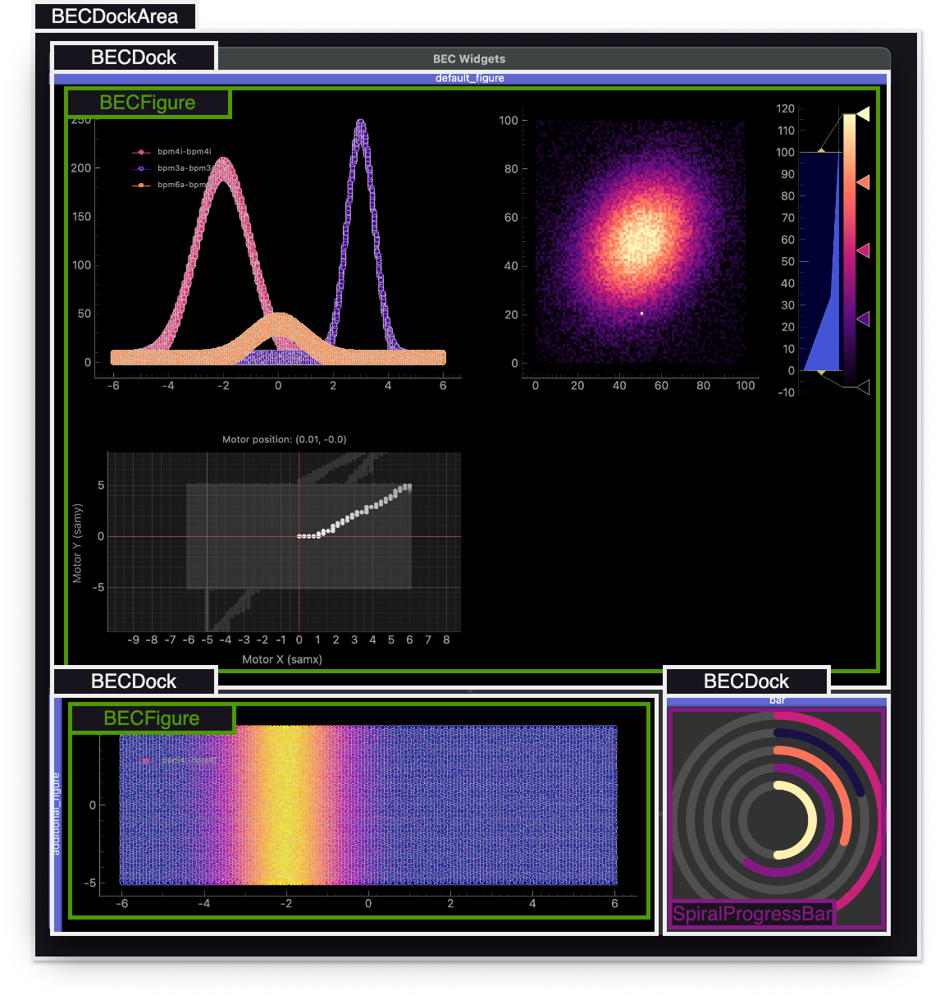

(user.command_line_introduction)=
# Quick start
In order to use BEC Widgets as a plotting tool for BEC, it needs to be [installed](#user.installation) in the same Python environment as the BEC IPython client (please refer to the [BEC documentation](https://bec.readthedocs.io/en/latest/user/command_line_interface.html#start-up) for more details). Upon startup, the client will automatically launch a GUI and store it as a `gui` object in the client. The GUI backend will also be automatically connect to the BEC server, giving access to all information on the server and allowing the user to visualize the data in real-time.

## BECGuiClient
The `gui` object is the main entry point for interacting with the BEC Widgets framework. It is an instance of the [`BECGuiClient`](/api_reference/_autosummary/bec_widgets.cli.client.BECGuiClient) class, which provides methods to create and manage GUI components. Upon BEC startup, a default [`BECDockArea`](/api_reference/_autosummary/bec_widgets.cli.client.BECDockArea) instance named *bec* is automatically launched.

A launcher interface is available via the top menu bar under New → Open Launcher. This opens a window where users can launch a new [`BECDockArea`](/api_reference/_autosummary/bec_widgets.cli.client.BECDockArea) instance, an [AutoUpdate](#user.auto_updates) instance, individual widgets or a custom *ui file* created with *BEC Designer*. Alternatively, users can launch a new [`BECDockArea`](/api_reference/_autosummary/bec_widgets.cli.client.BECDockArea) from the command line:

```python
dock_area = gui.new() # launches a new BECDockArea instance
gui.new('my_dock_area') # launches a new BECDockArea instance with the name 'my_dock_area'
dock_area2 = gui.my_dock_area # Dynamic attribute access to created dock_area
```

``` {note}
If a name is provided, the new dock area will use that name. If the name already exists, an error is raised. If no name is specified, a name will be auto-generated following the pattern *dock_area_ii* where *ii* is the next available number. Named dock areas can be accessed dynamically as attributes of the gui object.
```


## BECDockArea
The [`BECDockArea`](/api_reference/_autosummary/bec_widgets.cli.client.BECDockArea) is a versatile container for quickly building customized GUIs. It supports adding new widgets either through the CLI or directly via toolbar actions. Widgets must be added into [`BECDock`](/api_reference/_autosummary/bec_widgets.cli.client.BECDock) instances, which serve as the individual containers. These docks can be arranged freely, detached from the main window, and used as floating panels.

From the CLI, you can create new docks like this:

```python
dock_area = gui.new()
dock = dock_area.new(name='my_dock_area')
dock = gui.new().new()
```

<!-- **Schema of the BECDockArea**

 -->

## Widgets
Widgets are the building blocks of the BEC Widgets framework. They are the visual components that allow users to interact with the data and control the behavior of the application. Each dock can contain multiple widgets, albeit we recommend for most use cases a single widget per dock. BEC Widgets provides a set of core widgets (cf. [widgets](#user.widgets)). More widgets can be added by the users, and we invite you to explore the [developer documentation](developer.widgets) to learn how to create custom widgets.
For the introduction given here, we will focus on the plotting widgets of BECWidgets. 

<!-- We also provide two methods [`plot()`](/api_reference/_autosummary/bec_widgets.cli.client.BECFigure.rst#bec_widgets.cli.client.BECFigure.plot), [`image()`](/api_reference/_autosummary/bec_widgets.cli.client.BECFigure.rst#bec_widgets.cli.client.BECFigure.image) and [`motor_map()`](/api_reference/_autosummary/bec_widgets.cli.client.BECFigure.rst#bec_widgets.cli.client.BECFigure.motor_map) as shortcuts to add a plot, image or motor map to the BECFigure. -->

**Waveform Plot** 

 The [`WaveForm`](/api_reference/_autosummary/bec_widgets.cli.client.WaveForm) is a widget that can be used to visualize 1D waveform data, i.e. to plot data of a monitor against a motor position. The method [`plot()`](/api_reference/_autosummary/bec_widgets.cli.client.WaveForm.rst#bec_widgets.cli.client.WaveForm.plot) returns the plot object. 

```python
plt = gui.new().new().new(gui.available_widgets.Waveform)
plt.plot(x_name='samx', y_name='bpm4i')
```
Here, we create a new plot with a subscription to the devices `samx` and `bpm4i` and assign the plot to the object `plt`. We can now use this object to further customize the plot, e.g. changing the title ([`plt.title = 'my title' `](/api_reference/_autosummary/bec_widgets.cli.client.Waveform.rst#bec_widgets.cli.client.Waveform.title)), axis labels ([`plt.x_label = 'my x label'`](/api_reference/_autosummary/bec_widgets.cli.client.Waveform.rst#bec_widgets.cli.client.Waveform.x_label)) 
<!-- or limits ([`set_x_lim()`](/api_reference/_autosummary/bec_widgets.cli.client.Waveform.rst#bec_widgets.cli.client.Waveform.x_lim)).  -->

We invite you to explore the API of the WaveForm in the [documentation](user.widgets.waveform_1d) or directly in the command line.

To plot custom data, i.e. data that is not directly available through a scan in BEC, we can use the same method, but provide the data directly to the plot. 

```python
plt = gui.new().new().new(gui.available_widgets.Waveform)
# 
plt.plot([1,2,3,4], [1,4,9,16])
# or 
plt.plot(x=np.array([1,2,3,4]), y=np.array([1,4,9,16]))
# or 
plt.plot(np.random.rand(10,2))
# or if you like to receive the custom curve item
curve = plt.plot(x=[1,2,3,4], y=[1,4,9,16])
```

**Scatter Plot**

The [`WaveForm`](/api_reference/_autosummary/bec_widgets.cli.client.WaveForm) widget can also be used to visualize 2D scatter plots. More details on setting up the scatter plot are available in the widget documentation of the [scatter plot](user.widgets.scatter_2d).

**Motor Map**

The [`MotorMap`](/api_reference/_autosummary/bec_widgets.cli.client.MotorMap) widget can be used to visualize the position of motors. It's focused on tracking and visualizing the position of motors, crucial for precise alignment and movement tracking during scans. More details on setting up the motor map are available in the widget documentation of the [motor map](user.widgets.motor_map).

**Image Plot**

The [`Image`](/api_reference/_autosummary/bec_widgets.cli.client.Image) widget can be used to visualize 2D image data for example a camera. More details on setting up the image plot are available in the widget documentation of the [image plot](user.widgets.image).

### Useful Commands
We recommend users to explore the API of the widgets by themselves since we assume that the user interface is supposed to be intuitive and self-explanatory. We appreciate feedback from user in order to constantly improve the experience and allow easy access to the gui, widgets and their functionality. We recommend checking the [API documentation](user.api_reference), but also by using BEC Widgets, exploring the available functions and check their dockstrings.
```python
gui.new? # shows the dockstring of the new method
```

In addition, we list below a few useful commands that can be used to interface with the widgets:

```python
gui.windows  # Returns a dictionary of all dock areas in the GUI
gui.new()  # Adds a new BECDockArea to the GUI

dock_area = gui.windows['bec']
dock = dock_area.new('my_dock')  # Adds a new dock named 'my_dock' to the dock area
plt = dock.new(gui.available_widgets.Waveform)  # Adds a Waveform widget to the dock

# Alternative syntax:
# dock_area.my_dock.new(gui.available_widgets.Waveform)

dock.element_list  # Returns a list of all widgets in the dock
dock.elements  # Equivalent to dock.element_list

plt.curves  # Returns a list of all curves in the plot
```

We note that commands can also be chained. For example, `gui.new().new().new(gui.available_widgets.Waveform)` will add a new dock_area to the gui and add a new dock with a `Waveform` widget to the dock. 

## Composing a larger GUI
The example given above introduces BEC Widgets with its different components, and provides an overview of how to interact with the widgets. Nevertheless, another power aspect of BEC Widgets lies in the ability to compose a larger GUI with multiple docks and widgets. This section aims to provide a tutorial like guide on how to compose a more complex GUI that (A) live-plots a 1D waveform, (B) plots data from a camera, and (C) tracks the positions of two motors.
Let's assume BEC was just started and the `gui` object is available in the client. A single dock is already attached together with a BEC Figure. Let's add the 1D waveform to this dock, change the color of the line to white and add the title *1D Waveform* to the plot.

```python
dock_area = gui.new()
plt = dock_area.new().new(gui.available_widgets.Waveform)
plt.plot(x_name='samx', y_name='bpm4i')
plt.curves[0].set_color(color="white")
plt.title = '1D Waveform'
```

Next, we add 2 new docks to the gui, one to plot the data of a camera and one to track the positions of two motors. 
```ipython
cam_widget= dock_area.new().new(gui.available_widgets.Image)
cam_widget.image("eiger")
motor_widget = dock_area.new().new(gui.available_widgets.MotorMap)
motor_widget.map("samx", "samy")
```

Note, we chain commands here which is possible since the `new()` and `new()` methods return the dock and the widget respectively. We can now further customize the widgets by changing the title, axis labels, etc.

```python
cam_widget.title = "Camera Image Eiger"
cam_widget.vrange = [0, 100]
```
As a final step, we can now add also a RingProgressBar to a new dock, and perform a grid_scan with the motors *samx* and *samy*.
As you see in the example below, all docks are arranged below each other. This is the default behavior of the `new()` method. However, the docks can be freely arranged by drag and drop as desired by the user. We invite you to explore this by yourself following the example in the video, and build your custom GUI with BEC Widgets.

```python
prog_bar = dock_area.new().new(gui.available_widgets.RingProgressBar)
prog_bar.set_line_widths(15)
scans.grid_scan(dev.samy, -2, 2, 10, dev.samx, -5, 5, 10, exp_time=0.1, relative=False)
```


