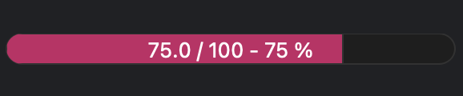
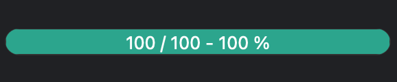

(user.widgets.bec_progressbar)=
# BEC Progressbar

```{tab} Overview

The BEC Progressbar widget is a general purpose progress bar that follows the BEC theme and style. It can be embedded in any application to display the progress of a task or operation. 

## Key Features:
- **Modern Design**: The BEC Progressbar widget is designed with a modern and sleek appearance, following the BEC theme.
- **Customizable**: Users can customize the appearance and behavior of the progress bar to suit their application.
- **Responsive**: The progress bar updates in real-time to reflect the progress of the task or operation.

## Screenshot



```

````{tab} Examples

The `BECProgressBar` widget can be integrated within a [`BECDockArea`](user.widgets.bec_dock_area) or used as an individual component in your application through `BECDesigner`. Below are examples demonstrating how to create and use the `BECProgressBar` widget.

## Example 1 - Adding BEC Status Box to BECDockArea

In this example, we demonstrate how to add a `BECProgressBar` widget to a `BECDockArea`, allowing users to manually set and update the progress states.

```python
# Add a new dock with a BECStatusBox widget
pb = gui.add_dock().add_widget("BECProgressBar")
pb.set_value(50)
```

````

````{tab} API
```{eval-rst} 
.. include:: /api_reference/_autosummary/bec_widgets.cli.client.BECProgressbar.rst
```
````
