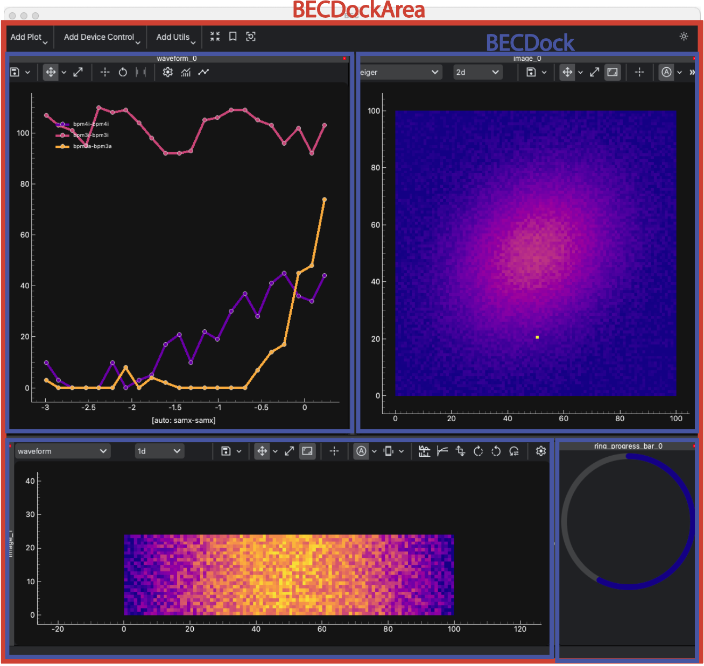

(user.widgets.bec_dock_area)=

# BECDockArea

````{tab} Overview

[`BECDockArea`](/api_reference/_autosummary/bec_widgets.cli.client.BECDockArea) is a powerful and flexible container designed to host various widgets and docks within a grid layout. It provides an environment for organizing and managing complex user interfaces, making it ideal for applications that require multiple tools and data visualizations to be displayed simultaneously. BECDockArea is particularly useful for embedding not only visualization tools but also other interactive components, allowing users to tailor their workspace to their specific needs.

- **Flexible Dock Management**: Easily add, remove, and rearrange docks within `BECDockArea`, providing a customized layout for different tasks.
- **State Persistence**: Save and restore the state of the dock area, enabling consistent user experiences across sessions.
- **Dock Customization**: Add docks with customizable positions, names, and behaviors, such as floating or closable docks.
- **Integration with Widgets**: Integrate various widgets like [`WaveformWidget`](user.widgets.waveform_widget), [`ImageWidget`](user.widgets.image_widget), and [`MotorMapWidget`](user.widgets.motor_map) into [`BECDockArea`](/api_reference/_autosummary/bec_widgets.cli.client.BECDockArea), either as standalone tools or as part of a more complex interface.

**BEC Dock Area Components Schema**


````

````{tab} Examples - CLI
In the following examples, we will use `BECIPythonClient` as the main object to interact with the `BECDockArea`. These tutorials focus on how to work with the `BECDockArea` framework, such as adding and removing docks, saving and restoring layouts, and managing the docked widgets. By default the `BECDockArea` is refered as `gui` in `BECIPythonClient`. For more detailed examples of each individual component, please refer to the example sections of each individual [`widget`](user.widgets).

## Example 1 - Adding Docks to BECDockArea

In this example, we will demonstrate how to add different docks to a single `BECDockArea` widget. New docks are always added to the bottom of the dock area by default; however, you can specify the position of the dock by using the `position` and `relative_to` arguments.

```python
# Create a new dock_area from GUI object
dock_area = gui.new()

# Add a new dock with a Waveform to the BECDockArea
dock_area.new(name="waveform_dock", widget="Waveform")
dock1 = dock_area.waveform_dock # dynamic namespace was created

# Add a second dock with a MotorMapWidget to the BECDockArea to the right of the first dock
dock2 = dock_area.new(name="motor_dock", widget="MotorMap",relative_to="Waveform Dock", position="right")

# Add a third dock with an ImageWidget to the BECDockArea, placing it on bottom of the dock area
dock3 = dock_area.new(name="image_dock", widget="Image")
```

```{hint}
You can move docks around by dragging them with the mouse using the dock's title bar. The dock will snap to the grid layout of the dock area.
```

## Example 2 - Access of Docks in BECDockArea

Docks can be accessed by their name or by the dock object. The dock object can be used to modify the dock properties or to add widgets to the dock.

```python
# All docks can be accessed by their name from the panels dictionary
dock_area.panels

# Output
{'waveform_dock': <BECDock with name: waveform_dock>,
 'motor_dock': <BECDock with name: motor_dock>,
 'image_dock': <BECDock with name: image_dock>}
# Access all docks from the dock area via list
dock_area.panel_list

# Access through dynamic namespace mapping
dock_area.waveform_dock
dock_area.motor_dock
dock_area.image_dock

# If objects were closed, we will keep a refernce that will indicate that the dock was deleted
# Try closing the window with the dock_area via mouse click on x

dock_area
# Output
<Deleted widget with gui_id BECDockArea_2025_04_24_14_28_11_742887>
```

## Example 3 - Detaching and Attaching Docks in BECDockArea

Docks in `BECDockArea` can be detached (floated) or reattached to the main dock area. This is useful when you want to temporarily undock a widget for better visibility or organization. 

```python
# Detach the dock named "Waveform Dock"
dock_area.detach_dock("waveform_dock")
# Alternatively, you can use the dock object to detach the dock
dock1 = dock_area.waveform_dock
dock1.detach()

# Docks can be individually reattached to the main dock area
dock2.attach()

# Reattach all floating docks to the main dock area
gui.attach_all()
```

```{note}
Floating docks are always returned to the original dock area if they are closed manually. Docks can also be detached by double-clicking on the dock title.
```

## Example 4 - Removing Docks from BECDockArea

Docks can be removed from the dock area by their name or by the dock object. The dock object can be used to remove the dock from the dock area.

```python
# Removing docks by their name
dock_area.delete("waveform_dock")
# Alternatively, you can use the dock object to remove the dock
dock1 = dock_area.motor_dock
dock1.remove()

# Removing all docks from the dock area
gui.delete_all()
```

```{warning}
When removing a dock, all widgets within the dock will be removed as well. This action cannot be undone, and all references to the dock and its widgets will be lost.
```
````

````{tab} API
```{eval-rst} 
.. include:: /api_reference/_autosummary/bec_widgets.cli.client.BECDockArea.rst
```
````

