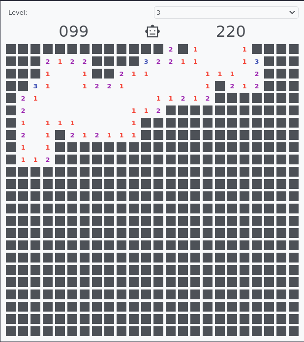

(user.widgets.games)=

# Game widgets

To provide some entertainment during long nights at the beamline, there are game widgets available. Well, only one, so far.

## Minesweeper

The classic game Minesweeper. You may select from three different levels. The game can be ended or reset by clicking on the icon in the top-centre (the robot in the screenshot).
