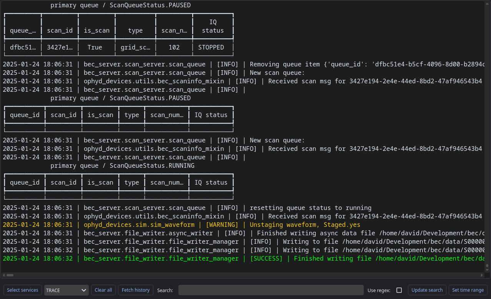
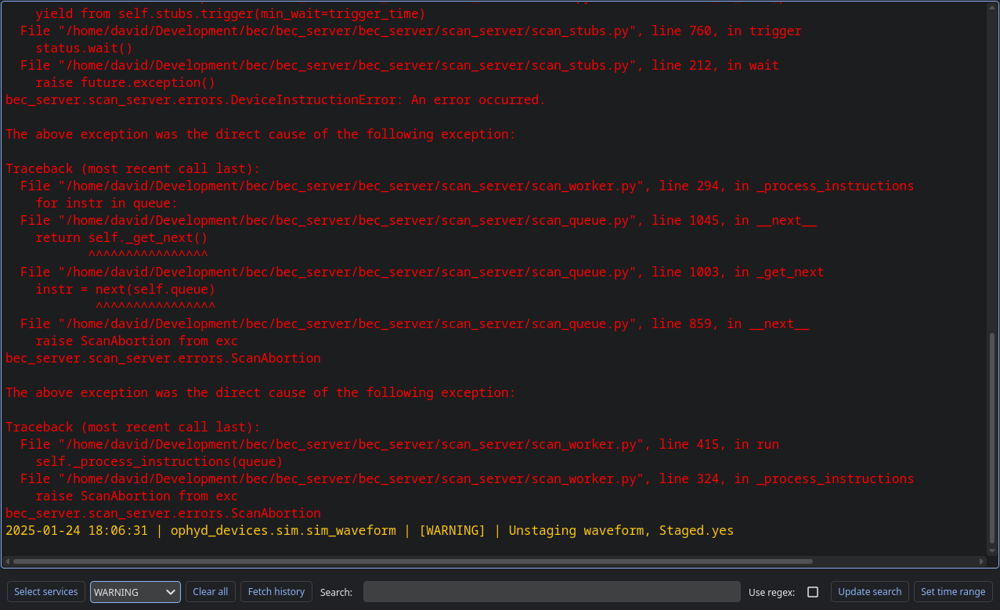
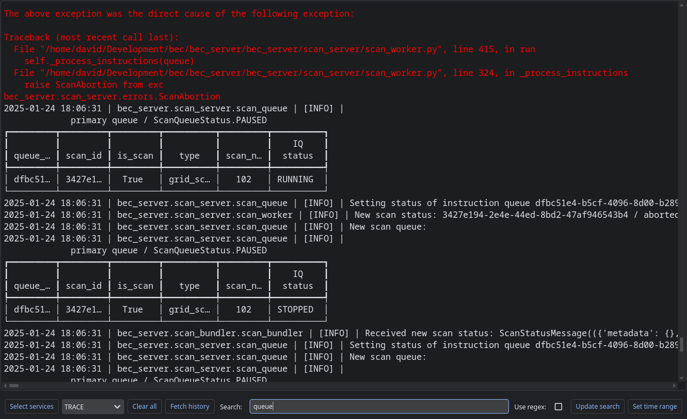
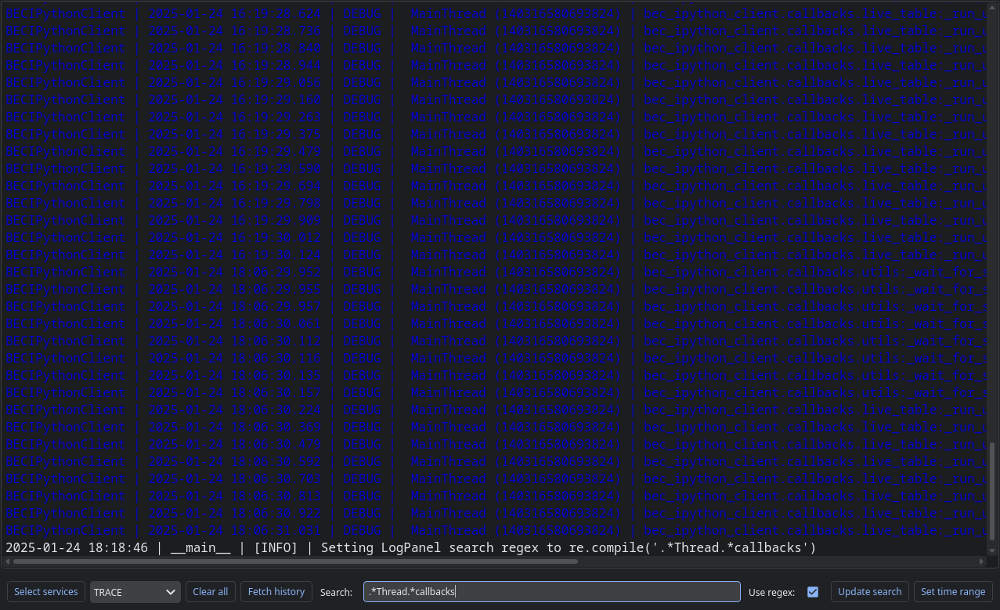
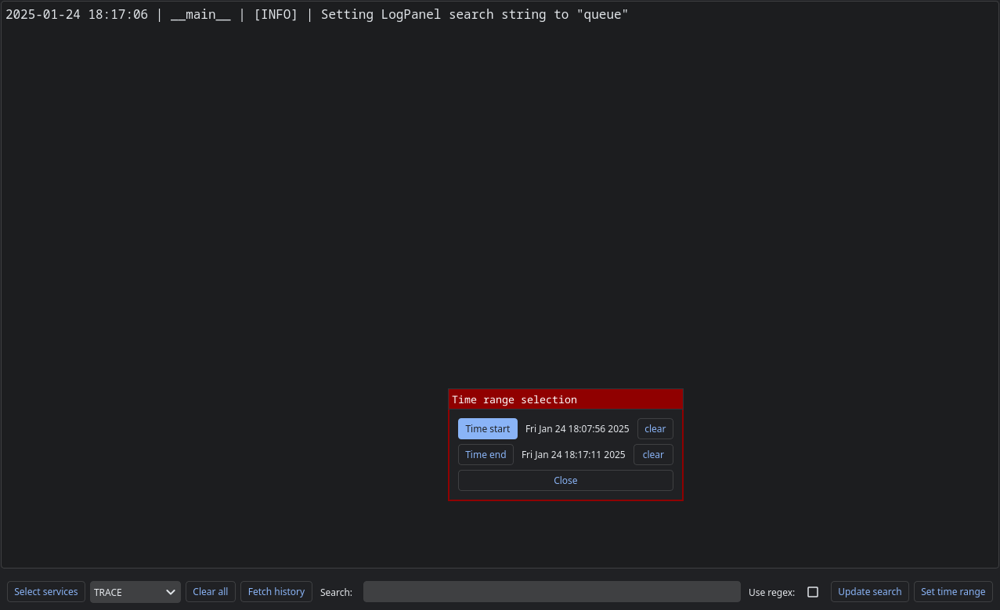
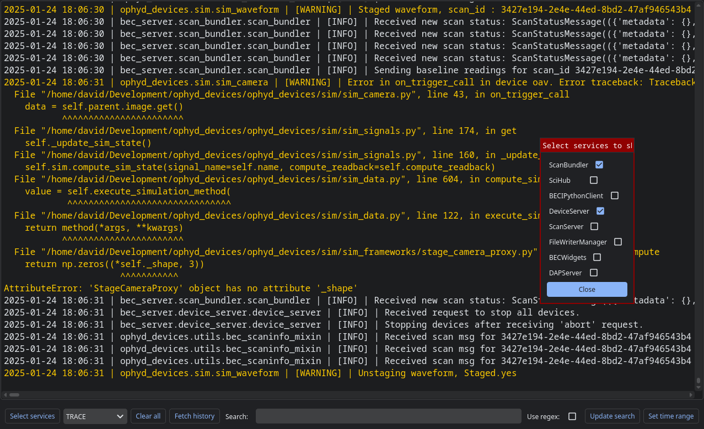

(user.widgets.log_panel)=

# LogPanel widget

The LogPanel widget can be used to view logs:

It automatically subscribes to log updates. You can fetch the log history with the "Fetch history" button.

## Filtering based on log level

If you select a dropdown box, only logs of that priority level or higher will be displayed:

## Filtering based on a search string

If you type in a search string into the box in the toolbar, and hit enter or press the update button, that filter will be applied:

This search uses the [Python regular expression syntax](https://docs.python.org/3/library/re.html) if the checkbox for this option is selected:

## Filtering based on time range

You may filter the logs to those occurring within a given time range.

## Filtering based on service

You can select which services to show logs from.

