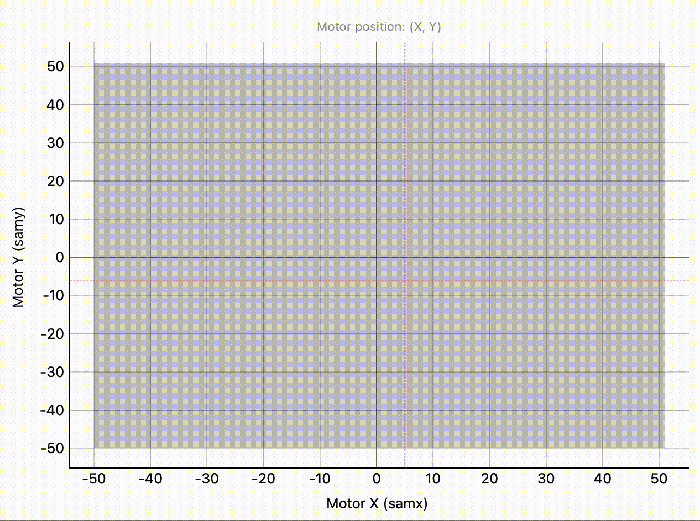

(user.widgets.motor_map)=

# Motor Map Widget

````{tab} Overview

The Motor Map Widget is a specialized tool for tracking and visualizing the positions of motors in real-time. This widget is crucial for applications requiring precise alignment and movement tracking during scans. It provides an intuitive way to monitor motor trajectories, ensuring accurate positioning throughout the scanning process.

## Key Features:
- **Flexible Integration**: The widget can be integrated into a [`BECDockArea`](user.widgets.bec_dock_area), or used as an individual component in your application through `BECDesigner`.
- **Real-time Motor Position Visualization**: Tracks motor positions in real-time and visually represents motor trajectories.
- **Customizable Visual Elements**: The appearance of all widget components is fully customizable, including scatter size and background values.
- **Interactive Controls**: Interactive controls for zooming, panning, and adjusting the visual properties of motor trajectories on the fly.


````

````{tab} Examples CLI
`MotorMapWidget` can be embedded in [`BECDockArea`](user.widgets.bec_dock_area), or used as an individual component in your application through `BECDesigner`. However, the command-line API is the same for all cases.

## Example 1 - Adding Motor Map Widget as a Dock in BECDockArea

Adding `MotorMapWidget` into a [`BECDockArea`](user.widgets.bec_dock_area) is similar to adding any other widget.

```python
# Add new MotorMaps to the BECDockArea
dock_area = gui.new()
mm1 = dock_area.new().new(gui.available_widgets.MotorMap)
mm2 = dock_area.new().new(gui.available_widgets.MotorMap)

# Add signals to the MotorMaps
mm1.map(x_name='samx', y_name='samy')
mm2.map(x_name='aptrx', y_name='aptry')
```

## Example 2 - Customizing Motor Map Display

The `MotorMapWidget` allows customization of its visual elements to better suit the needs of your application. Below is an example of how to adjust the scatter size, set background values, and limit the number of points displayed from the position buffer.

```python
# Set scatter size
mm1.scatter_size = 10

# Set background value (between 0 and 100)
mm1.background_value = 0

# Limit the number of points displayed and saved in the position buffer
mm1.max_points = 500
```

## Example 3 - Changing Motors and Resetting History

You can dynamically change the motors being tracked and reset the history of the motor trajectories during the session.

```python
# Reset the history of motor movements
mm1.reset_history()

# Change the motors being tracked
mm1.map(x_name='aptrx', y_name='aptry')
```
````

````{tab} API
```{eval-rst}  
.. include:: /api_reference/_autosummary/bec_widgets.cli.client.MotorMap.rst
```
````
