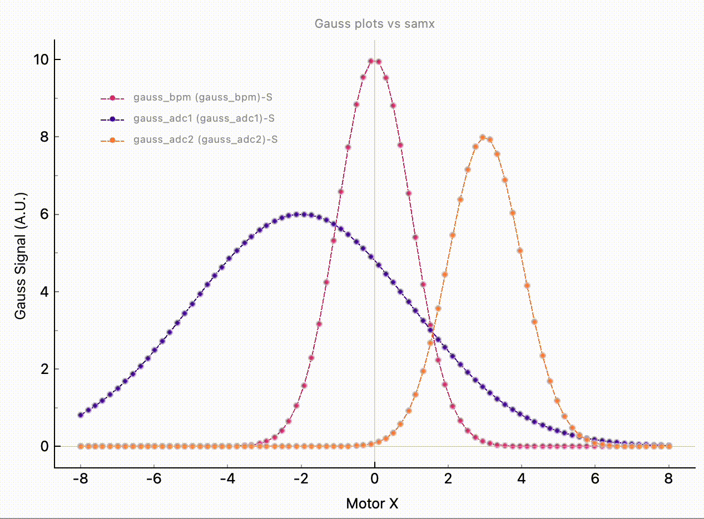
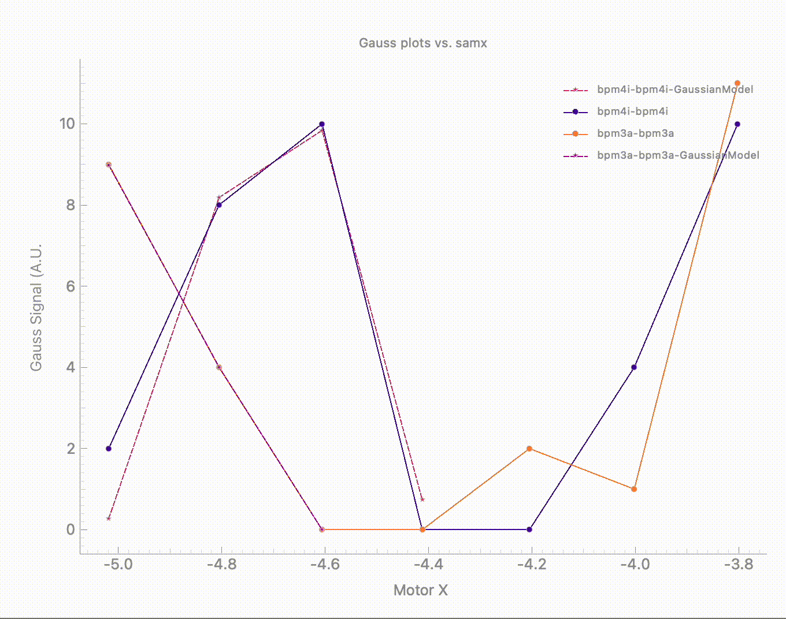

(user.widgets.waveform_widget)=

# Waveform Widget

````{tab} Overview

The Waveform Widget is used to display 1D detector signals. The widget is directly integrated with the `BEC` framework and can display real-time data from detectors loaded in the current `BEC` session as well as custom data from users.

## Key Features:
- **Flexible Integration**: The widget can be integrated into [`BECDockArea`](user.widgets.bec_dock_area), or used as an individual component in your application through `BEC Designer`.
- **Data Visualization**: Real-time plotting of positioner versus detector values from the BEC session, as well as static plotting of custom data.
- **Real-time Data Processing**: Add real-time Data Processing Pipeline (DAP) to the real-time acquisition.
- **Data Export**: Export data to CSV, H5, and other formats.
- **Customizable Visual Elements**: Customize visual elements such as line color and style.
- **Interactive Controls**: Interactive controls for zooming and panning through the data.


````

````{tab} Examples - CLI

`WaveformWidget` can be embedded in [`BECDockArea`](user.widgets.bec_dock_area), or used as an individual component in your application through `BEC Designer`. However, the command-line API is the same for all cases.

## Example 1 - Adding Waveform Widget as a dock with BECDockArea

Adding `Waveform` into a [`BECDockArea`](user.widgets.bec_dock_area) is similar to adding any other widget. 

```python
# Add new WaveformWidgets to the BECDockArea
dock_area = gui.new('my_new_dock_area') # Create a new dock area
plt1 = dock_area.new().new('Waveform')
plt2 = gui.my_new_dock_area.new().new(gui.available_widgets.Waveform) # as an alternative example via dynamic name space

# Add signals to the WaveformWidget
plt1.plot(x_name='samx', y_name='bpm4i')
plt2.plot(x_name='samx', y_name='bpm3i')

# set axis labels
plt1.title = "Gauss plots vs. samx"
plt1.x_label = "Motor X"
plt1.y_label = "Gauss Signal (A.U.)"

```

```{note}
The return value of the simulated devices *bpm4i* and *bpm3i* may not be Gaussian signals, but they can be easily configured with the code snippet below. For more details, please check the documentation for the [simulation](https://bec.readthedocs.io/en/latest/developer/devices/bec_sim.html).
```

```python
# bpm4i uses GaussianModel and samx as a reference; default settings
dev.bpm4i.sim.select_sim_model("GaussianModel")

# bpm3i uses StepModel and samx as a reference; default settings
dev.bpm3i.sim.select_sim_model("StepModel")
```
## Example 2- Adding Data Processing Pipeline Curve with LMFit Models

In addition to the scan curve, you can also add a second curve that fits the signal using a specified model from [LMFit](https://lmfit.github.io/lmfit-py/builtin_models.html). The following code snippet demonstrates how to create a 1D waveform curve with an attached DAP process, or how to add a DAP process to an existing curve using the BEC CLI. Please note that for this example, both devices were set as Gaussian signals. You can also add a region of interest (roi) to the plot which will respected by all running DAP processes. 

```python
# Add a new dock_area, dock and Waveform and plot bpm4i vs samx with a GaussianModel DAP
plt = gui.new().new().new('Waveform')
plt.plot(x_name='samx', y_name='bpm4i', dap="GaussianModel")

# Add a second curve to the same plot without DAP
plt.plot(x_name='samx', y_name='bpm3a')

# Add DAP to the second curve
plt.add_dap_curve(device_label='bpm3a-bpm3a', dap_name='GaussianModel')

# Add ROI to the plot, this limits the DAP fit to the selected region x_min=-1, x_max=1
# The fit will automatically update
plt.select_roi(region=(-1, 1))

```

To get the parameters of the fit, you need to retrieve the curve objects and call the `dap_params` property.

```python
# Get the curve object by name from the legend
dap_bpm4i = plt.get_curve("bpm4i-bpm4i-GaussianModel")
dap_bpm3a = plt.get_curve("bpm3a-bpm3a-GaussianModel")

# Get the parameters of the fit
print(dap_bpm4i.dap_params)
# Output
{'amplitude': 197.399639720862,
 'center': 5.013486095404885,
 'sigma': 0.9820868875739888}

print(dap_bpm3a.dap_params)
# Output
{'amplitude': 698.3072786185278,
 'center': 0.9702840866173836,
 'sigma': 1.97139754785518}
```



````

````{tab} API
```{eval-rst}  
.. include:: /api_reference/_autosummary/bec_widgets.cli.client.Waveform.rst
```
````